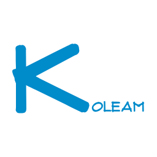

#

<!-- markdownlint-disable MD033 -->

  

<!-- markdownlint-enable MD033 -->

<!-- markdownlint-disable MD033 -->

  Self Host Video Streaming

<!-- markdownlint-enable MD033 -->

A simplified self hosting video streaming service using the browser to manage Titles as an Admin and stream the videos as a Member with the option of ease of use using a CLI or GUI to run/configure the Web App and API Service.

The project is split into two production applications the Desktop-App (Configuration/Installation Manager) and the Full-Stack (Web App and API Service).

 

## Documentation

- [Architecture Diagrams](/docs/Diagrams.drawio)
- [UI/UX Models Figma](https://drive.google.com/file/d/1TSNP8vOH9khhcZXWvTwpOm2T88706QnN/view?usp=drive_link)
- [Other Docs](/docs/)
- [Tools](/TOOLS.md)

## Discord

TBA
